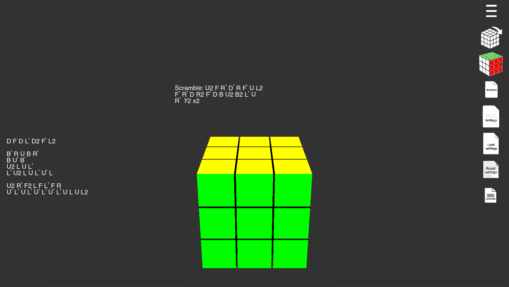

# 🧠 CubeCoach

CubeCoach is a lightweight Windows application that helps you improve your Rubik's Cube solving skills through visualization, feedback, and practice tools. Built with C++ and OpenGL.

[Discord Server](https://discord.gg/m2yucUac7z)

 <!-- Replace with actual image path -->

---

## 🚀 Features

- ✨ Visual cube training interface
- 💾 Lightweight and portable

---

## 📦 Download & Installation

Download the latest **CubeCoach Installer** from the [Releases](https://github.com/MagicMannnnn/CubeCoach/releases) page.

### 🪟 For Windows

1. Download `CubeCoach_Setup.exe` from the latest release.
2. Run the installer.
3. Follow the instructions — the installer will:
   - Display the license agreement
   - Install the app to `C:\Program Files\CubeCoach`
   - Add CubeCoach to the Windows start menu/search bar
